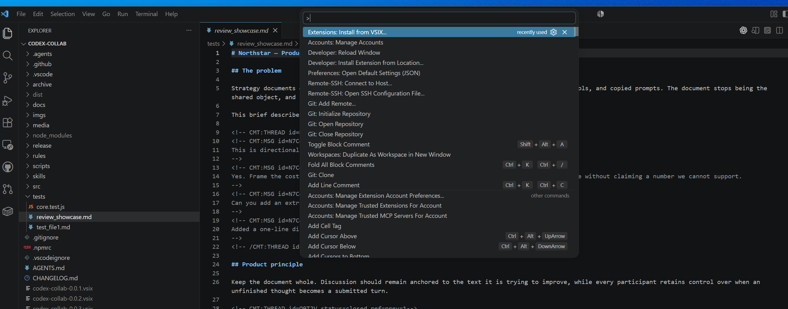
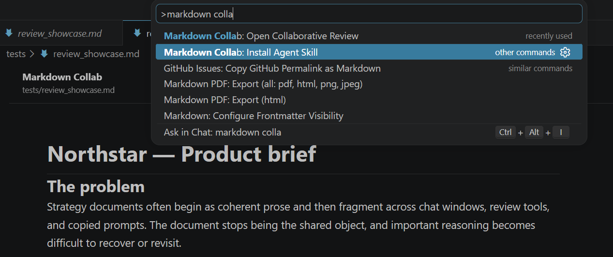
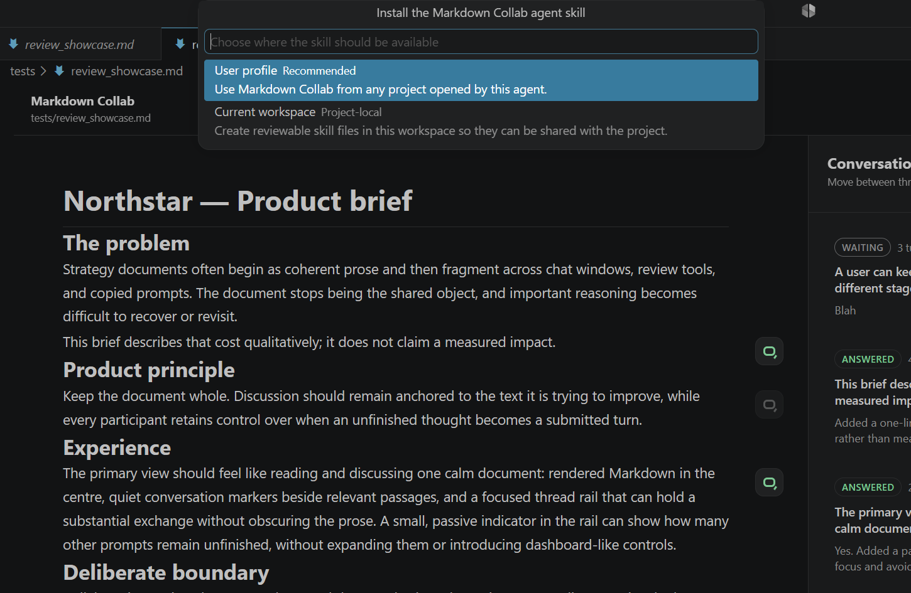
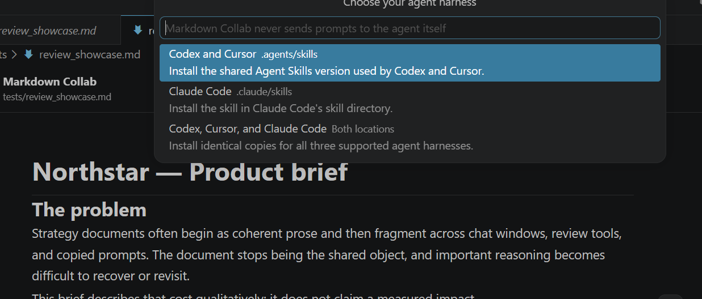

<p align="right">
  <a href="https://simpliq.io"></a>
</p>

# Markdown Collab

LLMs can be very useful when a technical document needs turning from rough notes into something other people can follow. They can draft a section, work through an argument or find a clearer explanation. Reviewing the result is where things get clumsy.

You spot a weak claim in one paragraph, a missing example in another and a section near the end that changes something near the start. In chat, those become a pile of quoted text and directions about where each change belongs. Separate discussions get mixed together, and you have to keep rebuilding the context.

Markdown Collab lets you have those conversations in the document instead. It is a VS Code-compatible extension that adds Quip/SharePoint-style threaded comments to Markdown.

Read the rendered document, open a thread beside any passage and leave comments as they occur to you. Some can stay as drafts. Others can be submitted and left waiting while you carry on. Each conversation keeps its place and history.

When you are ready for the LLM to respond, Markdown Collab copies a short prompt for your existing Codex, Claude or other agent chat. The agent reads all ready comments together, makes related edits in one turn and replies in the relevant threads.

Everything remains in Markdown. Threads are stored as hidden HTML comments in the file, so they travel with it through git. There is no hosted collaboration service or separate thread database, and Markdown Collab never sends a prompt or connects to a model - you just prompt your agent to review your latest comments in the regular chat window.

Built by [Simpliq](https://simpliq.io).

[See the review flow](#a-typical-review-pass) | [Privacy and trust](#privacy-and-trust)


## [Latest release](https://github.com/simpliq-dev/markdown-collab/releases/latest)

[Download the latest VSIX and `.tar.gz` release kit from GitHub Releases.](https://github.com/simpliq-dev/markdown-collab/releases/latest) The same release also provides [`SKILL.md` as a direct download](https://github.com/simpliq-dev/markdown-collab/releases/latest/download/SKILL.md).

## Work through the document together

- Discuss the exact passage that needs attention instead of describing its location in chat.
- Keep several lines of thought open at once without losing the draft or history in any thread.
- Submit a group of ready comments in one turn, giving the LLM the context to make related edits together.
- Bring responses back into the relevant threads so the reasoning stays attached to the document.
- Carry the document and its review history together as one portable, version-controllable Markdown file.
- Stay in control of what is ready, what is sent, and when a conversation is resolved or removed.

## Install Markdown Collab

Markdown Collab has two parts:

- The VSIX adds the document and conversation interface to VS Code or Cursor.
- The `markdown-collab` Agent Skill tells the agent working on the repository how to process submitted comments without damaging conversation history.

The extension does not install or call a model, create an account or send document content anywhere.

### 1. Install the VSIX

1. Open the [latest release](https://github.com/simpliq-dev/markdown-collab/releases/latest) and download `markdown-collab-<version>.vsix`.
2. In VS Code or Cursor, open the Command Palette and run **Extensions: Install from VSIX...**.
3. Select the downloaded file and reload the editor if prompted.



### 2. Install the agent skill from Markdown Collab

The skill is included inside the VSIX. The first time you open Collaborative Review, accept **Install skill**. You can also start the installer at any time by running **Markdown Collab: Install Agent Skill** from the Command Palette.



Choose whether the skill should be available from your **user profile** across projects, or stored in the **current workspace** so it can be reviewed and shared with that project.



Then choose **Codex and Cursor**, **Claude Code**, or both locations.



If a different `SKILL.md` already exists at the destination, Markdown Collab shows its path and asks before replacing that file. Existing `AGENTS.md`, `CLAUDE.md`, rules and other skills are not changed.

If you add or change agent harnesses later, run **Install Agent Skill** again and select the additional destination. Markdown Collab does not prompt a Codex-only user to install Claude Code, or vice versa.

### Install the skill manually instead

Download [`SKILL.md`](https://github.com/simpliq-dev/markdown-collab/releases/latest/download/SKILL.md), create a `markdown-collab` directory in the appropriate location, and save the file inside it as `SKILL.md`.

| Agent | User-wide installation | Project installation | Direct invocation |
| --- | --- | --- | --- |
| Codex | `~/.agents/skills/markdown-collab/SKILL.md` | `.agents/skills/markdown-collab/SKILL.md` | `$markdown-collab` |
| Cursor | `~/.agents/skills/markdown-collab/SKILL.md` | `.agents/skills/markdown-collab/SKILL.md` | `/markdown-collab` |
| Claude Code | `~/.claude/skills/markdown-collab/SKILL.md` | `.claude/skills/markdown-collab/SKILL.md` | `/markdown-collab` |

Other clients that support the open [Agent Skills](https://agentskills.io) format can use the same file in their documented skill location. Some agents take a snapshot of available skills when a conversation begins, so start a new conversation or restart the client if the skill does not appear immediately.

The release page also provides a standalone skill archive and a complete `.tar.gz` kit containing the VSIX, skill folder, installation notes and checksum. Those are useful for offline transfer or for inspecting everything before installation.

See [Installing the Markdown Collab skill](docs/install-agent-skill.md) for the same options in a standalone guide. The document protocol is described in [`COLLAB-RULES.md`](rules/COLLAB-RULES.md).

### Open your first review

1. Open a `.md` file.
2. Run **Markdown Collab: Open Collaborative Review** from the Command Palette, editor title icon or editor context menu.
3. Hover a rendered block and choose **Start conversation**.
4. Write the comment and choose **Submit turn** when it is ready for the agent. **Save draft** keeps it out of the next agent turn.

## A typical review pass

1. Start conversations beside each part of the document that needs attention.
2. Move between them freely. Each thread keeps its own unfinished text.
3. Save comments as drafts while they are still taking shape. Submit only the turns that are ready for action.
4. When several comments are waiting, choose **Copy prompt** beside **N comments ready**.
5. Paste that prompt into your existing Codex, Claude, or other agent conversation and send it once.
6. The copied prompt tells the agent to use the installed `markdown-collab` skill for that turn. The agent can then read the ready comments together, edit the document where appropriate, append responses to the handled threads, and verify that no conversation was lost.

Nothing is sent automatically, and Markdown Collab does not call a model. You decide what is ready and when the agent sees it.

## The editor and the agent do not have to match

You do not have to use the agent built into the editor. Markdown Collab reads and writes the repository, so the review interface and the agent can be separate tools.

You can use VS Code for the document and conversations while Codex CLI or Claude Code handles the edits. You can also use Cursor purely for the Markdown Collab interface while continuing the work in a separate Codex or Claude conversation. The agent only needs access to the same working copy and the installed skill.

The handoff stays simple:

1. Submit comments in Markdown Collab and save the file.
2. Choose **Copy prompt**.
3. Paste the prompt into whichever agent harness you prefer.
4. Let that agent edit the same repository and append its thread responses.
5. Return to the review view; it refreshes from the changed Markdown file.

This also means you can change models or agent products without migrating the document or its conversation history. Avoid using separate clones for the editor and agent unless you are deliberately moving changes between them.

## The document remains the source of truth

Submitted conversations are stored as HTML comments. Normal Markdown renderers hide them, while the source remains readable and version-controllable:

```md
<!-- CMT:THREAD id=ABCDE status=open ref=prev=1 -->
<!-- CMT:MSG id=ABCDE role=H ts=2026-07-16T12:00:00.000Z
Please pressure-test this claim.
-->
<!-- CMT:MSG id=ABCDE role=A ts=2026-07-16T12:01:00.000Z
The claim needs a narrower scope and a supporting source.
-->
<!-- /CMT:THREAD id=ABCDE -->
```

Collaborative Review is an opt-in view over the same file. The normal Markdown source editor remains available at any time.

## Current boundaries

Markdown Collab is currently an early, GitHub-distributed extension. VS Code is the only editor tested locally. Cursor can install the same VSIX through its VS Code-compatible extension APIs, but has not been tested locally.

- The extension does not inject text into an agent chat; copying and sending the handoff remains explicit.
- It is not yet distributed through the VS Code Marketplace.
- The published extension ID remains `simpliq.codex-collab` so existing installations can update without changing identity.

Issues and focused feedback are welcome through the repository's [issue tracker](https://github.com/simpliq-dev/markdown-collab/issues).

## Privacy and trust

Markdown Collab does not contact an external service, send telemetry, invoke a model, or maintain a separate conversation database.

Workspace content is treated as untrusted: raw HTML is disabled in the review renderer, remote images are not loaded automatically, external links require a click, and the Webview uses a restrictive content security policy. See [`PRIVACY.md`](PRIVACY.md).

## Develop locally

Prerequisites: VS Code, Node.js, and npm.

```sh
npm install
npm test
```

Open this repository in VS Code and press `F5` to launch an **Extension Development Host**. In that new window, open `tests/review_showcase.md` and run **Markdown Collab: Open Collaborative Review**.

Useful commands:

```sh
npm run build      # compile TypeScript
npm run test       # build and run regression tests
npm run package    # create a VSIX
npm run test-kit   # create the portable release folder
```

Tagged builds run the test suite and publish a VSIX plus a complete `.tar.gz` release kit through [GitHub Releases](https://github.com/simpliq-dev/markdown-collab/releases). Maintainer details are in [`docs/publish.md`](docs/publish.md).

## About Simpliq

[Simpliq](https://simpliq.io) builds practical tools and workflows that make complex knowledge work simpler.

## License

[MIT](LICENSE)
